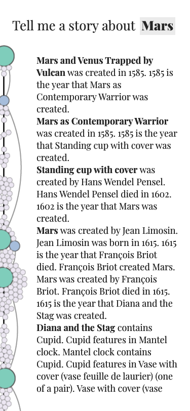
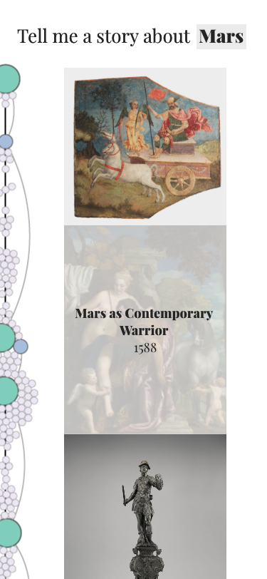
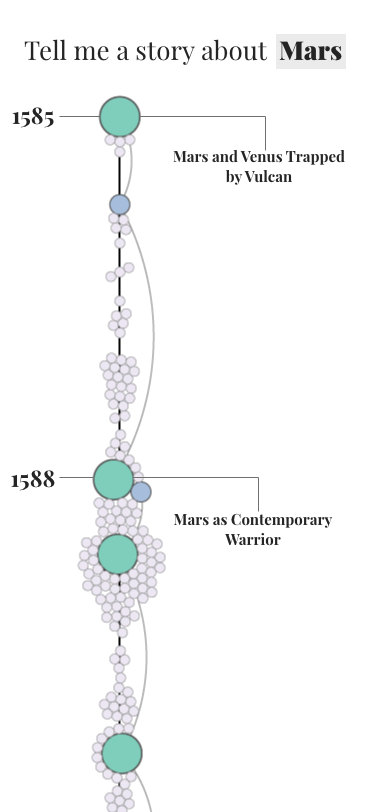
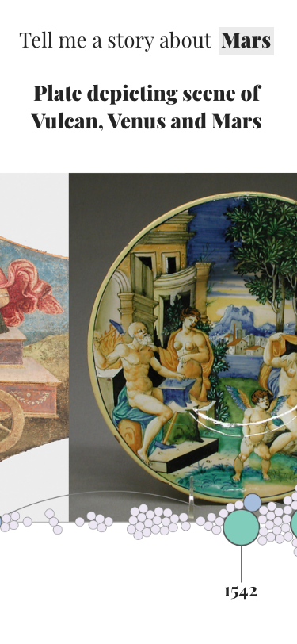
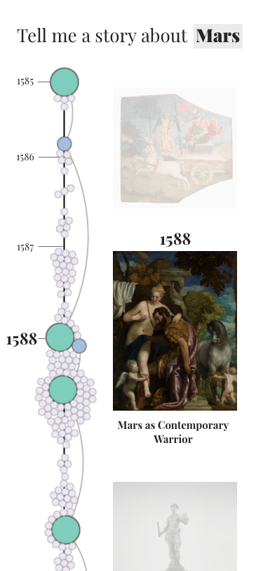
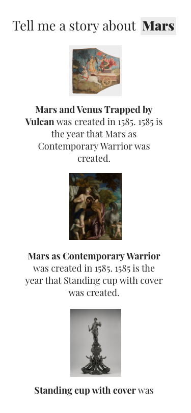
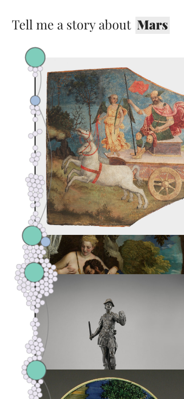

# New Context - MET Stories

## Give me feedback! - https://adobe.ly/2KXZAbL

## Considerations on current design
#### autocomplete does not work well on mobile
- Could be changed to drop down list allowing for selection to be completed above the keyboard on most mobile devices.
#### hover over nodes do not function
- Change to click action and remove hyperlink. The MET website can still be accessed for additional information by clicking on text links. 
#### less screen real estate
- maximize space for important features (the story and the images). 
- split the screen into separate views
- remove / hide menus

## Possible Ideas based on mobile platform
#### Swipe
- Swipe for both veritical scroll of longer pages (such as the story, images or timeline) and left to right to swipe between individual views (using CSS snap scroll)
#### Microphone
- use of microphone for data entry via voice recognition using [Google speech to text](https://cloud.google.com/speech-to-text/).
#### Camera 
- use of camera to scan QR codes [within the museum](https://d279m997dpfwgl.cloudfront.net/wp/2015/09/0914_museums-future03.jpg) as a starting point for the story.
#### Geolocation
- request geolocation as a starting point for the story.
#### pinch to zoom
- zoom into small photos
#### motion
- nodes move around on movement of the phone (computationally expensive)
## Possible Extensions
- Social media intengration to scan for possible starting points to the story
## save files
- ability to save the story for offline reading (PDF printer friendly layout)

## Designs

