# Do you have to be dead to get in the MET?
## Van Gogh sold only a single painting during his lifetime, yet *Starry Night* is now valued at over $100 million. 
This visualization investigates whether art only becomes 'art' only after an artist has died, by looking at The MET's aquisitions in realtion to an artists lifespan. 
The graph is split in the middle with artworks from deceased artists on the left and artsits still alive (at the time of aquisition) on the right. Only artworks from artists who were still alive at the opening of The MET in 1870 are included. Each year is broken down by departments. Users can choose to view the amounts by total number of artwork or percentage of artworks purchased that year.  
## [View The Project](http://neiloliver.co/design/MET/)  
Want to find out more about the custom graph written in .P5? Or how the information was extracted from the MET API? You can check out the [Technical Documentation.](https://github.com/neil-oliver/Major-Studio-1/tree/master/Quantitative-Design)  

#### Video
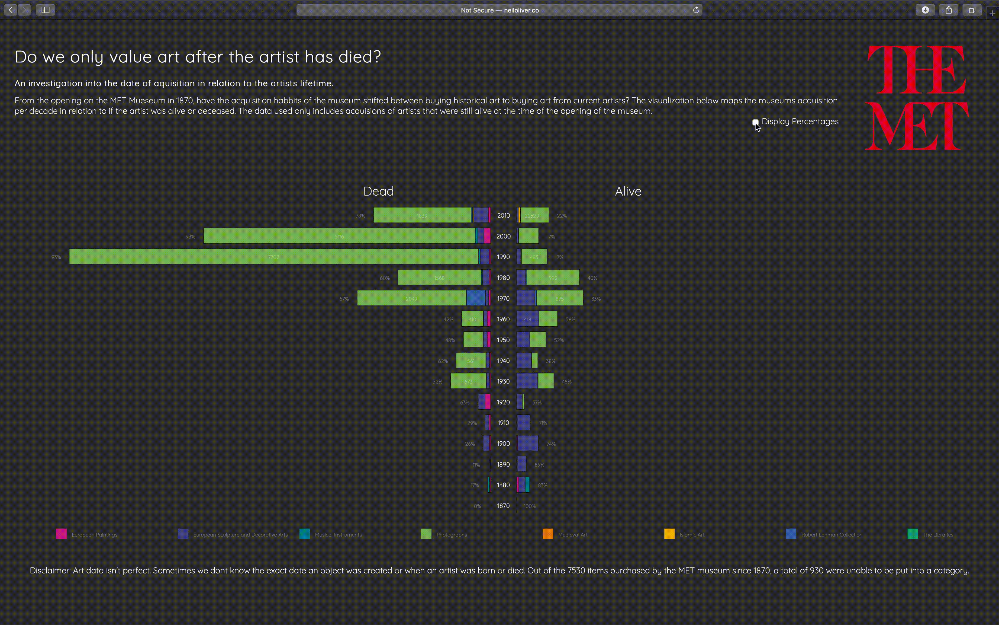
#### Images
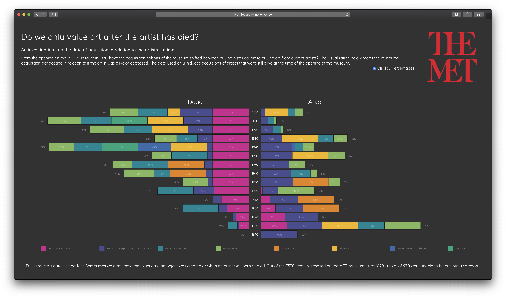
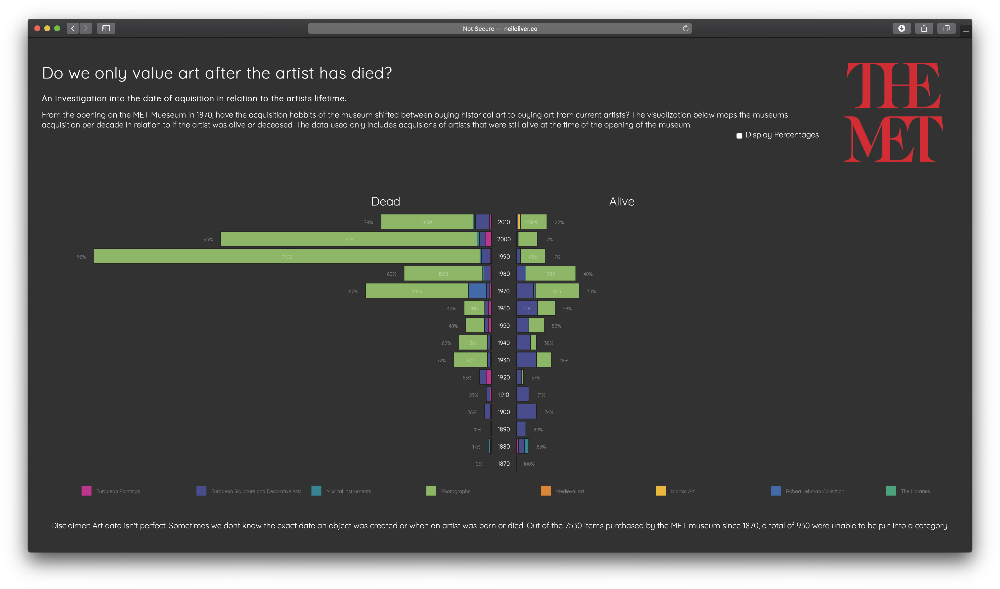

# A Story of The MET Collection
## Six degrees of Kevin Bacon, but for The MET Collection.
We all have things in common, we might be the same age, born in the same place, go to the same college; the possiblities are endless. The same theory can be applied to the artworks in The MET collection.
Behind the scenes, this visualization linked up every artwork in The MET using dates, locations, people and even the content of the artworks (for example the artwork contains a dog). Starting with a random artwork, these links are explored and an endless story is created navigating through 36 billion possible links. You will never read the exact same story twice.  
## [View The Project](https://neil-oliver.github.io/Major-Studio-1/Qualitative-Design/)  
Combining science and the arts; you can find out how graph theory was applied to The MET collection in the [Technical Documentation](https://github.com/neil-oliver/Major-Studio-1/tree/master/Qualitative-Design)  

#### Video

#### Images
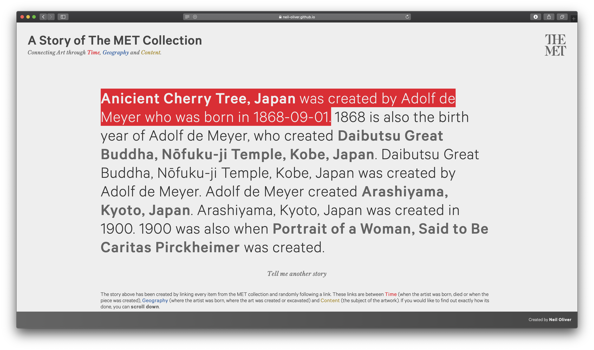
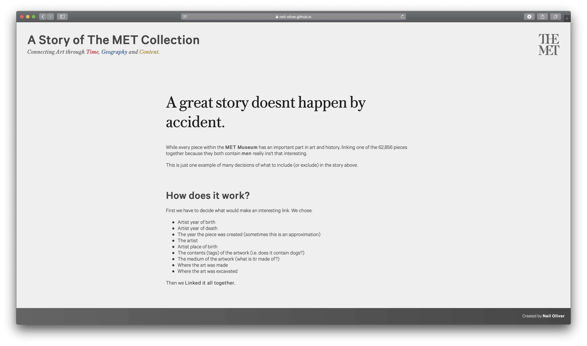
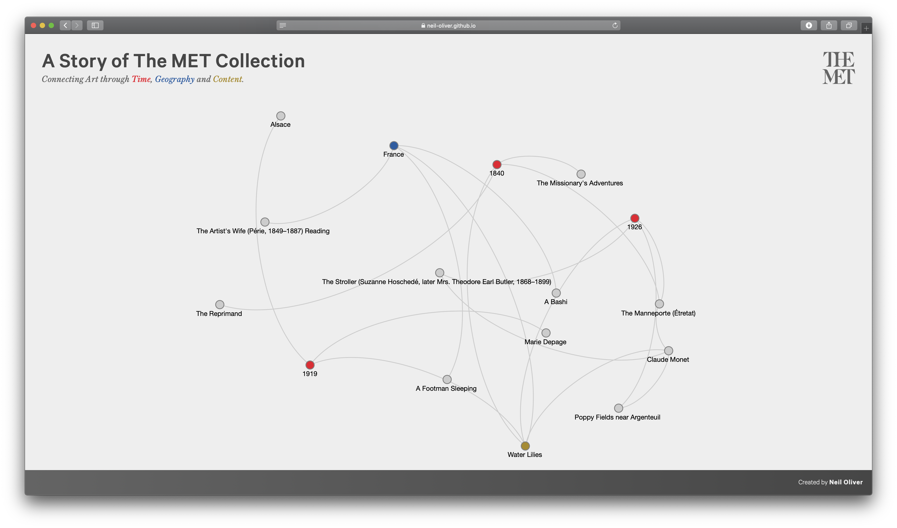
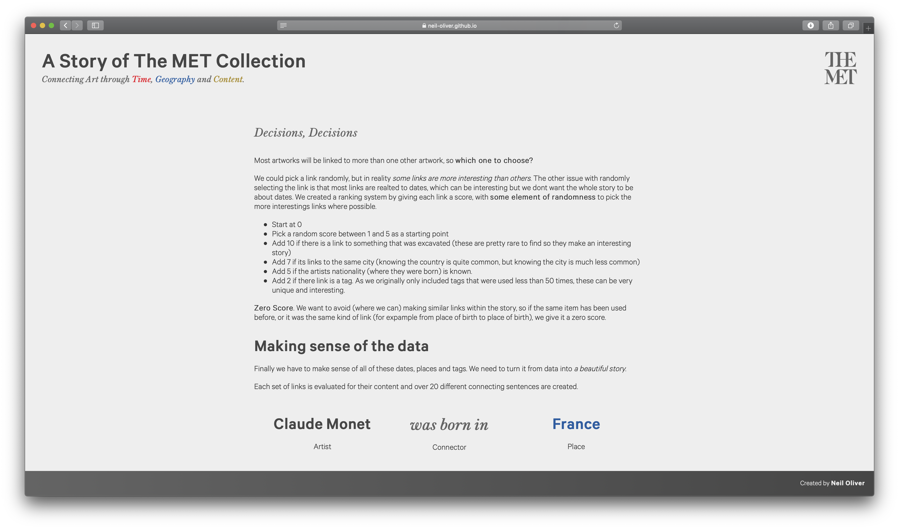
  

# MET Stories
## Tell Me A Story About... Anything!
Building on 'A Story of The MET Collection', *MET Stories* goes one step further to allow a story to be told about a specific topic, and visualize how the story is jumping through time. Once the user enters a keyword, a timeline is produced showing all of the artworks related to that word and a story of how they link togther. The artworks are displayed as a group but can be singled out to focus on the part is plays in the story, or switch to fullscreen mode to view them in all of their glory. Bored on the train and need something quick to read? MET Stories is the perfect quick read with its responsive design including a mobile friendly version.  
## [View The Project](https://neil-oliver.github.io/Major-Studio-1/New-Context/)  
A star Pathfinding, graph traversal, web workers and force layout simulations and loads more were all needed to make this project possible. All of the details can be found in the [Technical Documentation](https://github.com/neil-oliver/Major-Studio-1/tree/master/New-Context)  

#### Video

#### Images
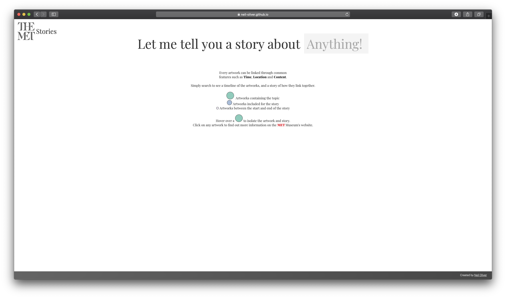

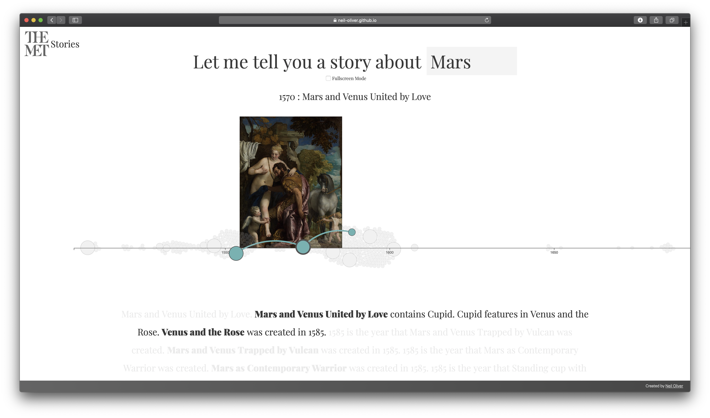
### Mobile
#### Images
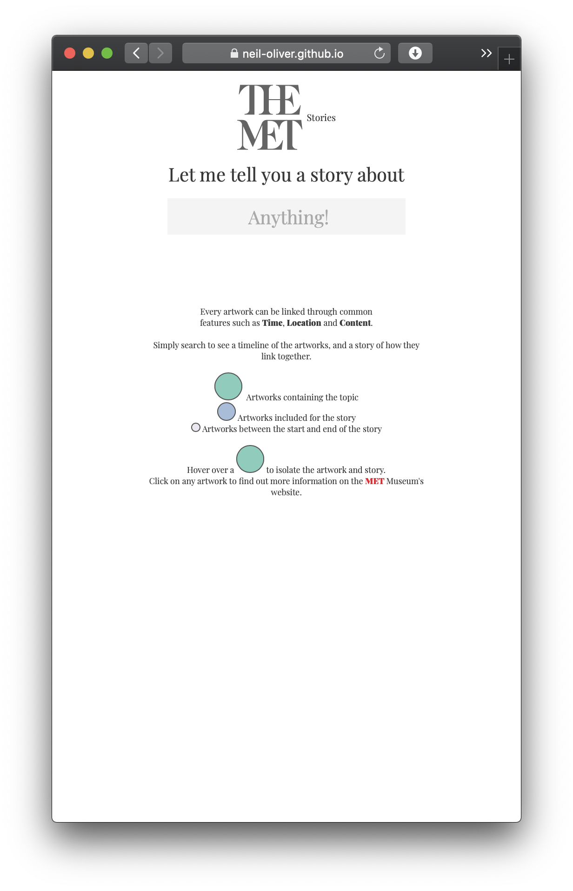
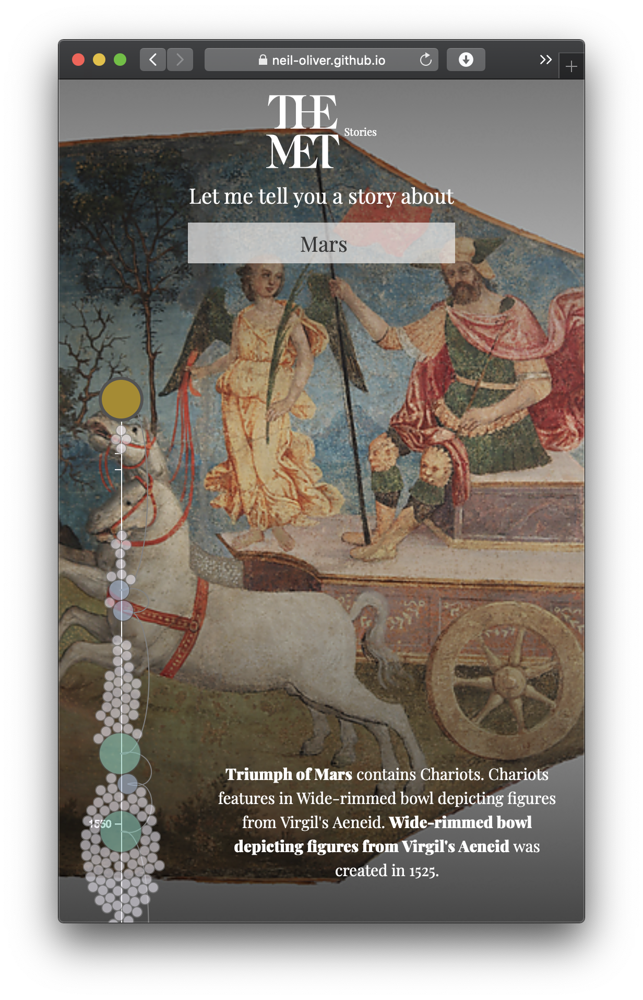
#### Video

  
# Major Studio Presentations
[Design Studio - Nadieh Bremer](https://github.com/neil-oliver/Major-Studio-1/tree/master/Design-Studio)  
[Data Visualization Method - Scatter Plots](https://github.com/neil-oliver/Major-Studio-1/tree/master/DV-Method)